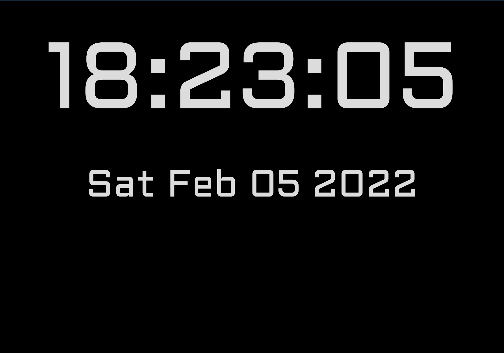

# Digital Live Clock
 

 

## I made this project to practice:

 

- newDate()
- setInterval()
- toDateString()
- toLocaleTimeString()
- Functions
- Dom Manipulation 
- @import fonts to CSS

 

### More Projects:
https://code-camp-responsive-wd-ld9d03x7e-migsilva89.vercel.app/